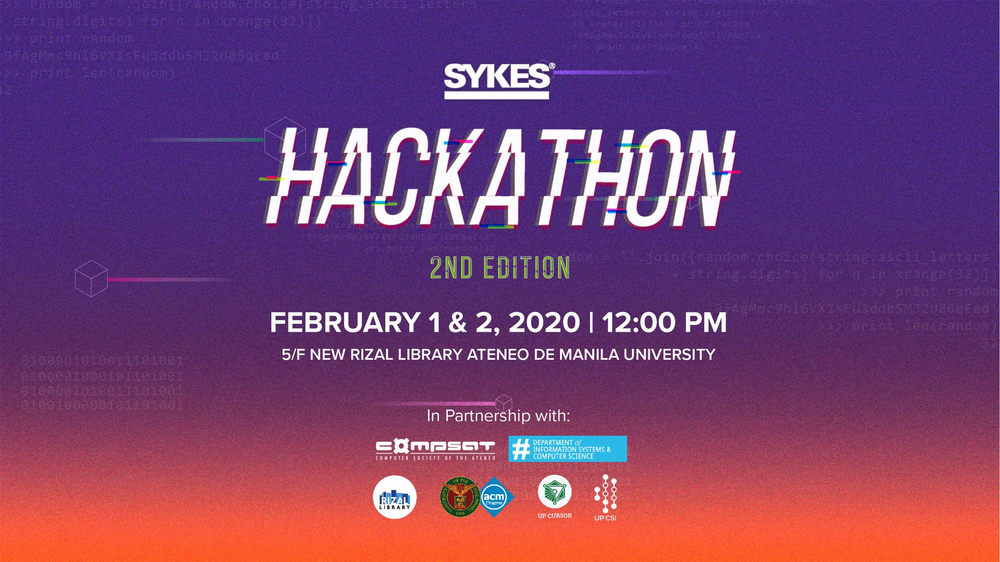

## Outline of this post:

### 1. Why did I do this? 

### 2. How did I prepare?

### 3. What was the experience like and how did I win?

### Why did I do this?

Last year, I made it a goal to get to a point in my career where I could take first place in the annual Sykes-sponsored data science hackathon held in Ateneo De Manila University. I was always interested in Data Science and data work in general upon graduating from high school. During freshman year, the first Sykes Data Science Hackathon had taken place, and I thought this would be a good opportunity to meet people interested in the field as well. 

This was a Kaggle-style competition hosted by Sykes, an American multinational process outsourcing company, wherein the winner was decided by who had the most accurate predictions at the end of the competition. The three teams with the top predictions would then give a presentation to industry veterans who would then critique the team's understanding of the model and the value of the types of predictions they were making as well as their ability to communicate these things to stakeholders.

The experience was a rough reminder of the gap that still existed between me and my college peers more interested and dedicated to the craft. After struggling for most of the 20 hours to figure out the libraries required to make an even rudimentary submission into the competition portal, I had given up.

This proved to be an exciting goal for 19 year-old Alec; to create a 20-year old Alec that would be capable enough at both the statistical methods and presentation skills to properly take the first place spot. 

### How did I prepare?

I spent the year belting through the most commonly recommended machine learning resources recommended on the internet. As someone who had practically no programming experience to speak of, I had to create a road map that started at properly learning the workings of a programming language. 

I spent the greater half of the year floundering around with online guides teaching excel and SQL, not knowing that these didn't interface directly with the types of tasks tested for by the Kaggle competition. At least by this point, I had also somehow become familiar with Python syntax through a [freecodecamp](https://www.youtube.com/watch?v=rfscVS0vtbw) video.

It was only when I stumbled upon Jeremy Howard's videos from the Fast AI team that I was given a proper understanding of how data science skills contributed to data tasks within a product, and the specific domain of skills tested in Kaggle style competitions. 

For more context on Jeremy Howard and Fast AI, you can check out their website, but the short of it is that he's a professor at the University of San Francisco dedicated to making hands-on machine learning easy to pick up and learn. 

Having wasted 7 months already on skills that wouldn't contribute to winning this competition, I decided to strap in my boots and binge through the ~16 hours of course lectures Jeremy's team had at the time called [introduction to machine learning for coders](https://www.youtube.com/watch?v=CzdWqFTmn0Y&list=PLfYUBJiXbdtSyktd8A_x0JNd6lxDcZE96) to understand what machine learning actually was and when it was and wasn't appropriate to use certain models.

The material itself was hyper-tailored for my use case as the course had embedded old Kaggle competitions in its curriculum with the first lecture running us through the pipelines of getting results slightly better than the first place of a sales price regression competition.

### What was the experience like and how did I win?

Coming into the competition and knowing everything that needed to be done was a glorious feeling. The task this year was to predict the percent likelihood each consumer would participate in a promotion program. 

We were given 5 fact tables with different dimensions of data about a consumer such as their purchasing and promotion participation history or anonymized personal data about customers.

The merging of these fact tables into a single dim table was completed 5 hours into the competition when I had decided a comprehensive list of computed features that I felt could be predictive. A lot of analytics in this stage of engineering is hypothesis testing after all.

I ran the whole 50+ feature through a random forest classifier, then looked through the feature importance of each feature that the model outputted. The top 20 features had combined feature importance that represented over 99% of the total feature importance. Safe to say, I no longer had to worry about more than half of the features and cut them out. 

The focus that feature importance filtering allowed me to have about which types of hypothesis to have let me work on a smaller subset of solutions given the short time I had for the hackathon. Overall, I credit this practice with giving me the win as it prepped the environment to let me take that win. 

Time features ended up increasing my score the most of any feature engineering I did for that competition. Encoding a days of the week column combined with all the other feature engineering I did that day was what ended up giving me the first place position among the submissions. I then spent the rest of competition hyperparameter tuning and slightly my overall AUC ROC score, but the trench between my score and second place from the first submission was never crossed.

Overall, the journey year-long journey from non-coder to being recognized as among the top of my peers was one that I treasure. This experience early on was a turning point for me that gave me the confidence to put myself in the situations I am sure will be described in future entries of this blog. 