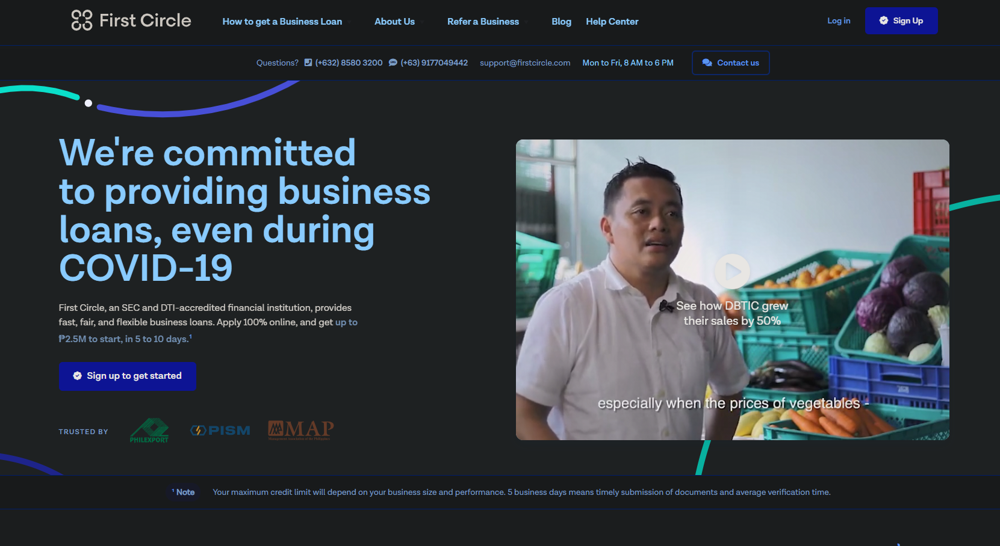
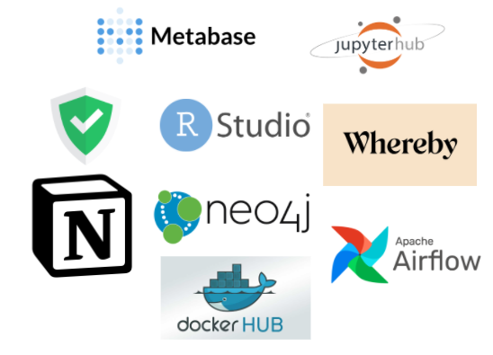

As of writing, I had just finished my 10-week long internship in First Circle's data team. I've had several internships before this, including an internship in the company's product team, but my experiences this time around were so memorable that I felt compelled to write this blog article about it. 

I would recommend anyone reading this who is interested in working in the field of data to apply for [First Circle](https://www.firstcircle.ph/) regardless of experience or lack thereof in the field.

## What is First Circle:

FirstCircle is an institution that provides financing to SMEs with the end goal of flattening their cash flow and growing their business. The company is home to a capable and technical team that pushes the envelope on the power and ideas enabled by digital technologies. 

This is a place where impact, social good, and customer benefits are serious topics that employees think long and hard about during multi-month strategy sprints. Collaboration is seen at every level of the company where anyone willing to contribute ideas.

## #1. I was able to own a multi-department project end-to-end as an intern:

Very few companies would let an intern immediately contribute to business decisions, and even fewer would let an intern own a whole company-wide engineering project from ideation to execution to post-launch monitoring and improvements. To have the opportunity and responsibility to deliver results as an intern speaks of the trust and expectation the team has for its interns.

### The Project Details:

I was assigned to figure out how to extract value from a Graph Database (Neo4j) that practically no one on the team had worked on before besides setting it up. I was given the database, some internal documentation, records from previous ideation sessions, and expectations to deliver good ideas. The project was free-form and open-ended with a relatively young technology that very few teams in the world, much less the Philippines, would know how to handle. This was magnified by the context of it being an analytics project as the majority of the people in the Neo4j community were web developers.

The language to pull data out of Neo4j was called Cypher, an imperative programming language semantically similar to SQL, but implemented with Java datatypes and functions. This understandably posed a large learning curve on its own in addition to the R and Python knowledge pre-requisite to joining data teams in general. 

### Contribution Highlights:

- Rewrote the pipeline for an algorithm they were running to surface duplicate data and sped it up by a factor of 140x turning a pipeline process that took over 24 hours per run into a process that finished in under 10 minutes.
    - This unlocked a wedge for unlocking insights on data costing millions of dollars that the team had previously abandoned as unfeasible due to the processing costs. My work unblocked this barrier.
- Organized weekly meetings with 2 departments in order to get their buy-in and cooperation on the operational changes that my project required.
    - This organized manpower and consolidated end-user expectations for data quality improvements.
- Made several UIs and ETL scripts for the ForestAdmin platform.
    - We used Forest Admin as a tool for analysts to manually make changes within our data warehouse when necessary.
- Made tracking dashboards for the company to track progress in cleaning out duplicate entries.
    - This allowed managers and manpower to view in real time changes in the department's backlog.
- I ran a short study on whether risk propagated across the social network of buyers and sellers within the First Circle data warehouse.
    - Graph algorithms and statistical analysis were used to determine whether we could use our current user network to predict default risk factors among customers.
- Ideated and launched graph network metrics that allow the company to understand how new data points affect network health over time.
    - We wanted to know how new data collected impacted the top-level metrics of our user network. This allows us to see if and how new customers connect to old customers.

### Challenges I met:

The team didn't pull any punches on bad proposals I would make if I couldn't articulate the business value of my ideas. A standard of clearly communicated and existing value needed to be met in addition to the responsibility of teaching myself this new technology.  I couldn't just take the top 10 most popular use-cases of the technology and present those; I needed to dig deeper and do the work of finding the most concerning issues that the company was facing that this technology could solve before I could be allowed to proceed by the rest of the team.  

### Endpoints of the Project:

In the end, I was able to successfully pitch and implement:

- 2 iterations of a multi-department effort to improve the company's overall data quality.
- 1 risk propagation analysis that was presented to and accepted by the team.
- 1 data health metric that will allow the team to keep track of how new data will impact the quality of the data network the company is currently maintaining.

    

    A non-comprehensive snapshot of the management and development tools used in First Circle for my project.

### #2 My preferences and skills were taken into account for the type of project I was given:

Before my first day in the data team, I was given an interview with one of the managers of the data team where I was asked a series of questions related to my interests and self-appraisal of technical skills. They asked about my goals, future career plans, working style, and interests in order to best contextualize the projects and support they would give me during my internship. Many internship programs would just give low-level work spillovers to interns regardless of whether this was relevant to the job description or would build the type of skills the interns express vocal interest in learning and building up. 

I told them three key points that were all taken into consideration by the team:

1. I was interested in technical work that would involve Data Engineering. 
    - I was given the task of creating the workstream of a new data product used by the team (Neo4j).

2. I would like to improve my technical communication skills.
    - I was given the opportunity to create educational resources and give engineering demos to other departments within the company where I could communicate the value and potential of this technology for the company.
3. I wanted a bird's eye view of the technological backbone of the data team.
    - There was a lot of transparency as far as how all the systems worked an interacted with each other. I was often offered the chance to pair up with members of the team working on sections of technology that were beyond the scope of my project just so I could have a better understanding of how everything worked.

### #3 They respected that I was a human being with weaknesses, priorities, and bad days:

### The Sick Day:

Every morning, we would log the things we were going to do that day on a website called Statushero. In Statushero, you have the option of setting an emoji that would correspond to how you felt about the day. 

On a particularly musty day, my allergies were acting up and I didn't feel so well, so I had decided to pick the "not feeling so well" emoji as an off-comment not thinking about it too hard. Within the first hour of the workday, the Head Manager of the Data Team pm-ed me directly and asked me if I wanted to take a sick day if I didn't feel well. It was a humanizing gesture I would not typically expect to receive in a company in the Philippines, much less as an intern.

### School Days:

In preparation for school starting in Vancouver in a few weeks, I felt no problems asking the team if I could work in Canadian time, which was 15 hours behind Philippine time. It was as simple as communicating my sleeping hours on the company calendar. I was never asked to work during my designated sleeping hours, and when I would break my own schedule to push in a few more changes to the codebase for the week, my bosses would even be the ones to remind me to sleep.

### # 4 Cross-functional collaboration directly affected the way we talk about work within the data team

Each of the data projects handled by members of the data team is always put into the context of the rest of the company, which makes sense since data analysis in my opinion is most useful in the context of informing decisions in other departments.

 

Data projects related to sales would have the data team members in charge of that project working closely to speak and collaborate with the sales team.

My project proposal, after deliberating on it with the whole team, was declared to be most relevant to the operations of Risk Operations and Customer Support. Working with them really allowed me to put into context the way I should communicate the technical details and features to people outside of data. 

Oftentimes, engineers insulated from their end-users build products wildly different from what the end-users actually want or need, and this creates friction between the two. This was minimized within FirstCircle's data team through the end-to-end structure of data projects wherein the person building things is required to actively talk to and explain the steps of the things they're building for the people they're building it for.

Their insights and knowledge in how their section of the company worked allowed me the insights and knowledge to do my job a lot better. Specifically, the insights they gave about the policies of how their department operates allowed me to identify the opportunities and weaknesses of that shipped build that were the focus of my second iteration of that project.

### # 5 The implicit culture of mentorship with equal footing within the data team

During the first two weeks of my internship, I was made to onboard onto the practices and tools used by the data team through an exhaustive list of tasks that would allow me to read through and interact with the current set of tools important to general data functions. The contents included tech tools like our data visualization platform called Metabase to ETL documentation on DBT to documents that outline the employee culture and structure First Circle has as a company at large. The process made it clear that it was okay to communicate and ask questions to any member of the team about anything that confused me or didn't make sense. I was never lost for too long as I felt that I could, when necessary, ask to be pointed in the right direction. Of course, this doesn't mean that I wasn't compelled internally to fix problems myself, that is of course my own pride as a tech worker, but I felt that I had a safety net whenever things when too far out of left-field.

There were team practices that contributed to this culture of mentor-ship such as pairing sessions, open messaging, and open voice channels contributed to me feeling comfortable asking questions or asking a team member to hop on a call with me to brainstorm if an idea made sense. 

It was made clear on my first day that this was a team that was expected to teach as much as it was expected of each member to learn new things. The overall effect of this culture gave me the impression of a university faculty wherein the pursuit and dispersal of knowledge was in itself a virtue to be maintained. This impression of the course was aided by the technical documentation and knowledge bases which were automated to be formatted in the style of academic citations.

## Conclusion:

Bearing in mind that many of my experiences and opinions are the outcome of how my personality and working-style meshed with the company's culture, I recommend anyone wanting to dig deep in a data career to try to apply to FirstCircle's data team or any other team in FirstCircle for that matter. It was an experience that gave me the motivation and feeling that I could fix any problem that I put my mind to and left in me solid principles for how an effective organization ought to operate.