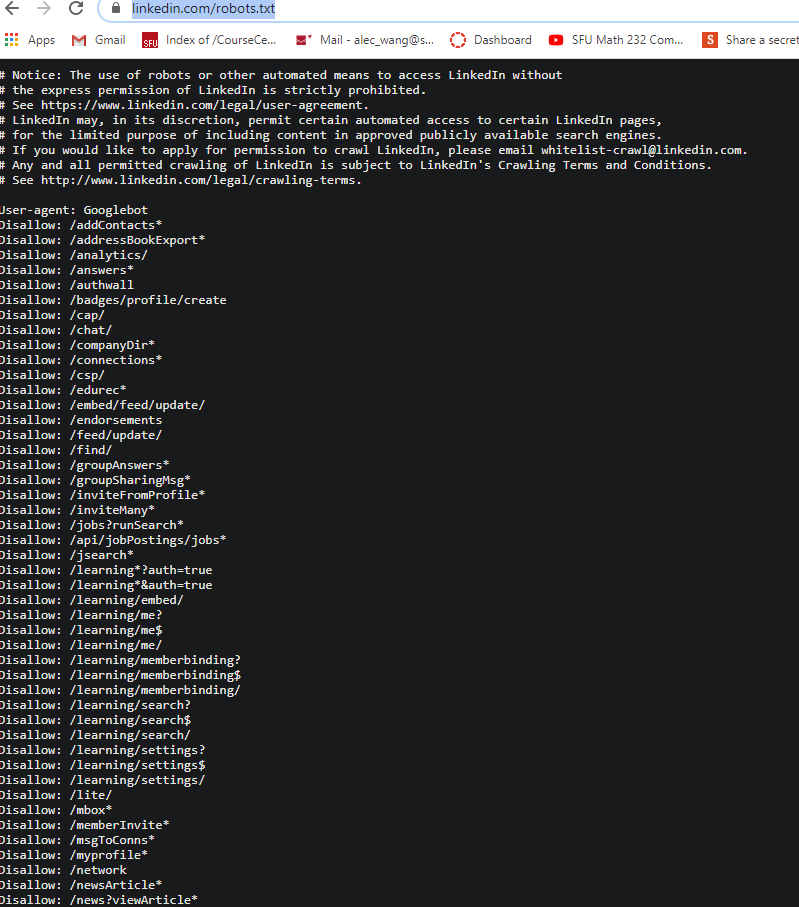
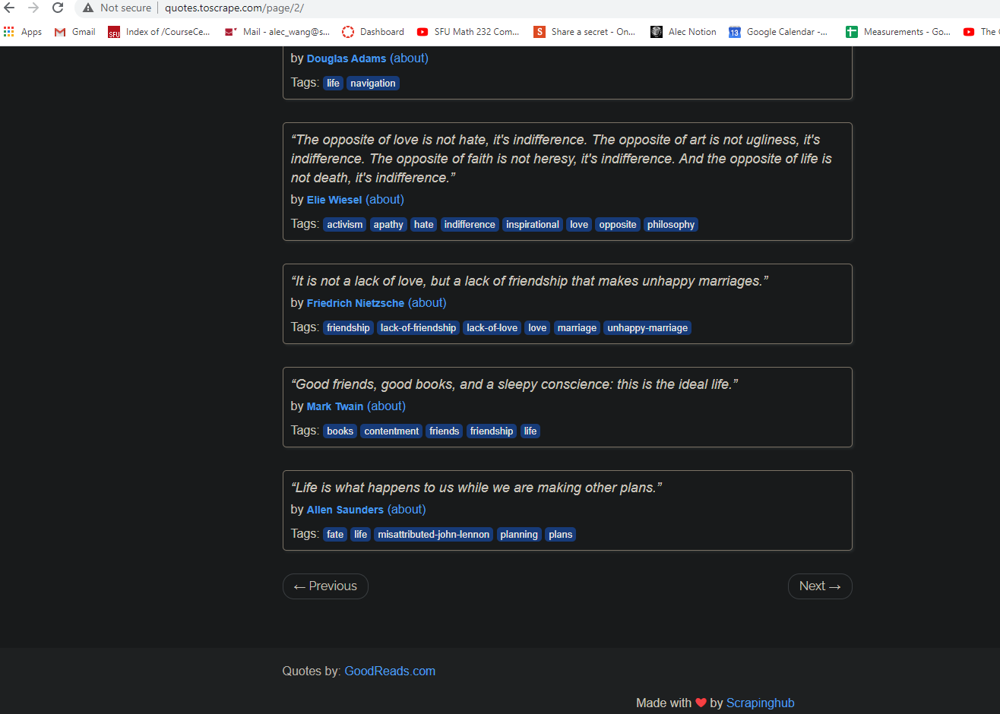
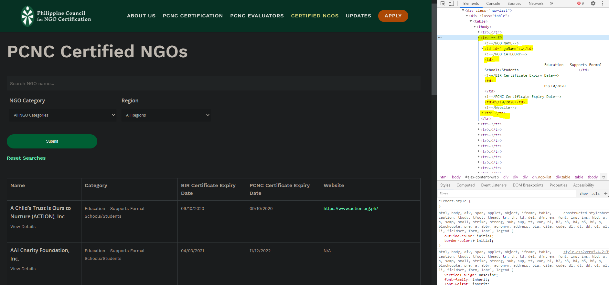
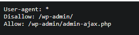
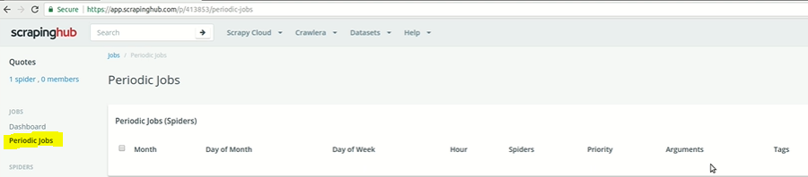

# Introduction to Crawling and Scraping the Web

Web scraping exists in a gray area between web activity automation and hacking because there is a constant arms race between people who want to get data and people who want to protect their data, so the resources and community available to most people aren't as accessible in my opinion to something compared to say Web Development. Scaling web scraping, deploying scrapers on a scheduler, and many such tasks are not always straightforward to find answers to.


Photo by Vidar Nordli-Mathisen on Unsplash

The act of web crawling and web scraping involves automating the process of collecting data from sources on the internet, mainly from websites. Much like a spider navigating their own webs, web crawling involves automating the traversal from one line to another in a purposeful manner whether it be figuring out the URL pattern of the webpages u want to scrape from, or navigating expected patterns among the clickable links of a webpage. 

This article seeks to inform the planning and preparations needed before a basic scrape job is started. This article will assume a basic knowledge in HTML file structures, and python scripting as I will be mainly using the python Scrapy framework. 

1. Scoping out the type of data you need to collect.
2. Understanding whether or not this data is being protected.
3. Figuring out the patterns needed to get the webpage responses that contain the data you want to collect.
4. Figuring out the most economical way to store your collected data. 
5. Simple Web Scraping Project Case-Study.

### Scope out the type of data you want to collect:

Understanding the scope of your project is a step in any technical project really that will define the rest of the following steps. 

- In what file format can this data be saved? (jpg, png, csv, json, etc.)
- Will this be a one-time scrape, or will I have to expect to run my scraper regularly?
- Would I only need to collect data from a single website?
- Do I need to consolidate multiple webpages worth of data?
- Can I find everything I need on a handful of listing sites?
- How is this data going to be used after I collect it?

These are all questions I try to go through in one form or another every time I undertake a scraping project because each of these questions informs the duration of work that will be required to attain your ideal results.

### Understand whether or not this data is being protected:

Different websites have different policies on how they'd like to be used and scraped. Some websites, like LinkedIn, make most of their money by selling their data in bulk, so they purposely make it difficult for individual user accounts to access the majority of user data by default.

To find out whether or not you will expect resistance from the website, typically one would go to their robots.txt page. The robots.txt page is a page that expressly describes what is allowed and disallowed by the parties managing this website. Some sites may only allow listing pages to be scraped, while others may only disallow accessing admin pages using bots for clear security reasons. 

The consequence of breaking this rule can range from being IP blocked by the website permanently to being brought to court for non-compliance, though the latter is definitely rare. 

For reference, the Scrapy config file should block you from going against a website's robots.txt by default most of the time, though you can turn it off if it is exhibiting blocking behavior that you do not want as a user. An example would be when you're using Scrapy to run tests on the contents of your own website, but you don't want other people scraping it. 



Linkedin has made it very clear they don't wanna be scraped. So what you do with that knowledge is at your own discretion. 

### Figuring out the patterns needed to get the webpage responses that contain the data you want to collect.

The 2 most common types of patter matching you'll have to do in basic web scraping is:

1. Webpage URL Matching
    - This involves making algorithmic modifications to webpages that you will make requests from.
    - The PCNC website for example has a listing page that goes like this:
        - [https://www.pcnc.com.ph/certified-ngos-list/?sf_paged=6](https://www.pcnc.com.ph/certified-ngos-list/?sf_paged=6)
        - [https://www.pcnc.com.ph/certified-ngos-list/?sf_paged=](https://www.pcnc.com.ph/certified-ngos-list/?sf_paged=6)7
        - [https://www.pcnc.com.ph/certified-ngos-list/?sf_paged=](https://www.pcnc.com.ph/certified-ngos-list/?sf_paged=6)8
        - [https://www.pcnc.com.ph/certified-ngos-list/?sf_paged=](https://www.pcnc.com.ph/certified-ngos-list/?sf_paged=6)9
        - Clearly you can just run a for loop that modifies the final character to get all of the pages you want to be scraping.
2. Website Layout Matching:

    Websites like [quotes.toscrape.com](http://quotes.toscrape.com) on the other hand have predictable **NEXT⇒** buttons that will allow you to navigate the pages by clicking a next button, which you can easily automate using a web-action automation framework like selenium to repeatedly click that button after you've extracted the data you want from it.  

    

### Figuring out the most economical way to store your collected data:

This isn't a concern for most scraping projects currently as to get more than 10 GBs of text would imply an immensely large scraping project that I could only guess would be above the 80th percentile of all scraping projects. This section mostly exists for image scraping projects that could be well above 2mb per image. In these cases, the limits of your data storage capacity start becoming a limiting factor in the amount of data you can collect.

One good solution I've found for this is writing scripts that, instead of harvesting images directly, collect the downloadable URLs of these images instead. These URLs more than 99% of the time will allow me to run a separate script to download the data on a cloud storage platform whenever I need it, giving me peace of mind to scrape without worrying too much about whether or not my hard drive can handle. This does however come at the risk of the links expiring the longer you keep it in this form, but in most cases, the trade-offs and expiration rate are worth it, especially in private projects.

### Case Study:

I will be running through these considerations in a case study of a recent small project I completed.

I was tasked with scraping for government-approved charities within the Philippines for a local charity rating group I help run called Effective Altruism. We wanted to know who were the charities that gain tax-exempt status on donations in order to create a framework that could rank-order them. We agreed early on that the data would best be passed to my end-users in a single CSV, as we were expecting under a thousand rows of text data. 



We found out that this data is easily accessible in a single [government-managed website](http://www.pcnc.com.ph/certified-ngos-list/'). This website stores data in 12 HTML rows per page, so the easiest way to go about this would be to loop over the rows and index the n-th column when it is relevant. 

Before this began, I took a quick look at their robots.txt page to see whether or not they had any rules in place for the type of scraping I was about to do. 



Based on the screenshot of their robots.txt, it seems like they had no qualms with what I was about to do at all, so I felt free to do whatever method I wanted. 

```python
import scrapy
from scrapy.http import Request
import re

class PcnSpiderSpider(scrapy.Spider):
    name = 'pcn_spider'
    allowed_domains = ['www.pcnc.com.ph/certified-ngos-list/']
    start_urls = ['http://www.pcnc.com.ph/certified-ngos-list/']

        
    def start_requests(self):
        print('start')
        url='http://www.pcnc.com.ph/certified-ngos-list/'
        yield Request(url, callback=self.parse)
        for i in range(2,41):
            url='http://www.pcnc.com.ph/certified-ngos-list/?sf_paged='+str(i)
            yield Request(url, callback=self.parse)
        
    def parse(self, response):
        rows = response.xpath('//tr')
        for i in range(1,len(rows)):
            NGO_Name=rows[i].xpath('td//text()')[0].extract()
            category=rows[i].xpath('td//text()')[2].extract()
            category=re.sub('\s+','',category)
            
            BIR_expiry_date=rows[i].xpath('td//text()')[3].extract()
            BIR_expiry_date=re.sub('\s+','',BIR_expiry_date)
            
            PCNC_expiry_date=rows[i].xpath('td//text()')[4].extract()
            PCNC_expiry_date=re.sub('\s+','',PCNC_expiry_date)
            website=rows[i].xpath('td/p/a/text()').extract_first()
            yield { 
                'NGO_Name':NGO_Name, 
                'category':category, 
                'BIR_expiry_date':BIR_expiry_date,
                'PCNC_expiry_date':PCNC_expiry_date,
                'website':website
               }
```

### Explaining the code:

The code above runs through my favorite way of dealing with table rows and other row-like dividers. I would simply write a for a loop around each of the relevant rows, indexing starting at 1 in order to not copy over the column names every time.

The data would then be cleaned using the regex statement that removes the tab and break-line statements that are extracted by default. The dictionary within the yield statement is the names and data rows within the columns respectively. Every time yield is run, you can expect that to map to a new data point whatever that may be.

If the script doesn't contain **start_requests()** function, the parse function is run automatically when you run the script, whereas with the **start_requests()** function you can more easily define URL changes that are passed into the parse function, which is passed to the Request function together with the URL of the page you want to scrape. 

The pattern I figured out for the data I wanted to collect was as simple as looping over the URL of the webpage I was interested in and changing the number at the end from 2 to 40. I do however caution this method somewhat as it happens asynchronously and too many loops (over 10,000) could be perceived as a DNS attack by the website, but for 40 requests, this was not a concern whatsoever.

The data produced by this script came out to be less than 10 MB altogether, so data storage was no concern of mine whatsoever. 

Bonus:

If any of you email your interest in learning a step-by-step on how to run, deploy, and schedule this case-study project from scratch all the way to scheduling spiders on srapinghub, email me at productivity.alswang18@gmail.com, and I will release an article dictating just that. Feel free to reach out for a consultation call as well if you can't figure out a project, or just wanna hire me for a scrape job.

